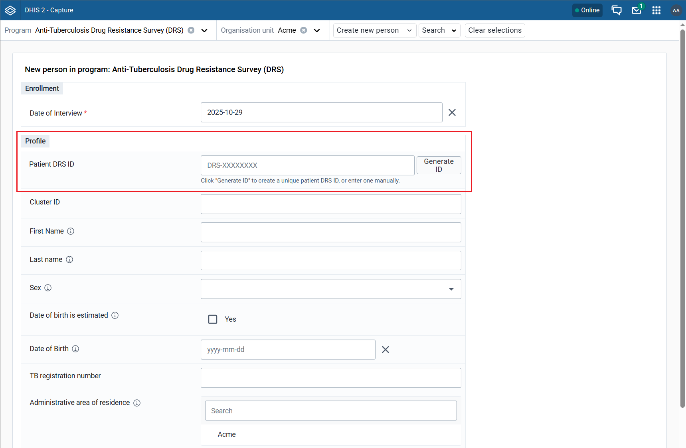

# Form Field Plugin - Reference Implementation

1. [What is included in this reference implementation](#what-is-included-in-this-reference-implementation)
2. [Quick Start](#quick-start)
3. [Overview](#overview)
   + [DHIS2 Capture App Plugin](#dhis2-capture-app-plugin)
   + [DHIS2](#dhis2)
4. [Tracker Plugin Configurator](#tracker-plugin-configurator)
      - [Install Tracker Plugin Configurator from App Hub](#install-tracker-plugin-configurator-from-app-hub)
      - [Configure the Plugin](#configure-the-plugin)
5. [Customizing This Example](#customizing-this-example)
6. [Support](#support)

## What is included in this reference implementation?

Form Field Plugins are a way to extend the functionality of native Capture forms in DHIS2. These plugins are injected directly into enrollment and event forms, allowing developers to add custom UI components and business logic without forking or maintaining a separate version of the Capture app.

This reference implementation illustrates a [DHIS2 Capture app plugin](https://developers.dhis2.org/docs/capture-plugins/developer/getting-started) that generates unique patient identifiers for use in a Capture enrollment form. The plugin demonstrates a simple patient ID generator that automatically creates IDs in the format `DRS-XXXXXXXX` and locks the field after generation to prevent accidental modification.

The ID generation algorithm in this example is intentionally simplified for demonstration purposes. It **SHOULD NOT** be used directly in production without adapting it to your local context. In real-world implementations, you would replace this with your own business logic, such as:

- Integration with external registries (see the [Reference Civil Registry Lookup](https://github.com/dhis2/reference-civil-registry-lookup))
- Custom validation rules
- Calls to external ID generation services
- Complex data transformations

This is an example meant to guide you in developing your own form field plugin solution.

## Quick Start

You can use the included [Docker Compose config](docker-compose.yml) to run this self-contained example in a non-production environment. This config stands up the DHIS2 container and seeds it with example metadata and plugin configuration.

The following prerequisites need to be installed prior to running the config with Docker Compose:

* [Docker Desktop](https://docs.docker.com/desktop/)
* [Node.js](https://nodejs.org/en/download) (v18 or higher)
* [Yarn](https://classic.yarnpkg.com/lang/en/docs/install)

Once the prerequisites are installed and the Git repository has been cloned to the local machine, run the subsequent terminal commands to build the components, start all services with [Docker Compose](https://docs.docker.com/compose/), and seed the system with example metadata and the plugin configuration:

```sh
yarn install --frozen-lockfile
yarn build
yarn start
```

Follow the steps below to get an overview of the functionality included in this reference implementation:

1. Open http://localhost:8080 from your browser to bring up the DHIS2 login page.
2. Log into DHIS2 using the username `admin` and password `district`. 
3. When logged in, navigate to the Capture app and select the DRS program.
4. Create a new person enrollment to see the plugin in action.
5. From the form, click the `Generate ID` button to create a unique patient DRS ID.
6. After clicking the button, the field becomes locked to prevent accidental modification.



## Overview

The purpose of this form field plugin is to demonstrate how custom logic can be injected into DHIS2 Capture forms using plugins. This implementation showcases a DHIS2 Capture form field plugin that a developer can reference to guide the development of their own plugin. The plugin follows best practices that match the functionality offered by DHIS2 v40.5 and later.

What follows is a brief overview of the components:

### DHIS2 Capture App Plugin

The Capture app plugin is a [DHIS2 web app](https://developers.dhis2.org/docs/quickstart/quickstart-web/) with a Capture plugin entrypoint. The source code is located in the `capture-plugin` directory of the reference implementation project. 

The plugin renders a text field together with a "Generate ID" button. The text field can be manually edited by the user or automatically populated by clicking the generate button. Once an ID is generated, both the field and button become disabled to prevent accidental changes.

#### Plugin Entry Point

The plugin is defined in the [`d2.config.js`](capture-plugin/d2.config.js) file with a plugin entrypoint:

```javascript
module.exports = {
    name: 'capture-plugin',
    type: 'app',
    entryPoints: {
        plugin: './src/Plugin.tsx'
    },
    pluginType: "CAPTURE",
}
```

The main plugin component (`Plugin.tsx`) receives props from the Capture app and renders the custom field component (`IdField.tsx`). The plugin interacts with the parent form through callback functions provided as props.

#### Updating Values from the Plugin

To update values from the plugin, you can use the `setFieldValue` function that is passed as a prop to the plugin:

```typescript
setFieldValue({
    fieldId: 'id',           // The alias configured in the field map
    value: 'example-id',     // The value to set
    options: {
        ...
    }
});
```

#### Updating Context Values

You can also update context values from the plugin using the `setContextFieldValue` function. Context values are values that explain the context of the data, such as the geometry, the date of the event, or the date of enrollment:

```typescript
setContextFieldValue({
    fieldId: 'occurredAt',  // Context field: occurredAt, enrolledAt, or geometry
    value: '2025-01-01',
});
```

#### Props

The props that a form field plugin can expect are [documented in detail on the DHIS2 developer portal](https://developers.dhis2.org/docs/capture-plugins/developer/form-field-plugins/developer-details#props). Here is a summary:

```typescript
interface IDataEntryPluginProps {
    values: Record<string, any>              // Current form values
    errors: Record<string, string[]>         // Field errors
    warnings: Record<string, string[]>       // Field warnings
    formSubmitted: boolean                   // Form submission state
    fieldsMetadata: Record<string, FieldMetadata>  // Field configuration
    setFieldValue: SetFieldValue             // Update field values
    setContextFieldValue: SetContextFieldValue  // Update context fields
}
```

#### Sandboxed Environment

A form field plugin runs in a sandboxed environment, meaning it can only read and write data that it has been configured to have access to. If the plugin is given access to a field, all relevant values, metadata, and rules engine output for that field is provided.

If a plugin tries to update a field that it has not been given access to, an appropriate error message will be displayed in the console.

### DHIS2

The minimum version of your DHIS2 instance should be at least [v40.5](https://dhis2.org/downloads/) when seeking to adapt the reference implementation. DHIS2 is customized in this setup to present a Tracker enrollment form where the plugin is embedded.

The data store in this DHIS2 instance defines the subsequent keys driving the behavior of the Capture app:

A `dataEntryForms` key residing in the `capture` namespace that holds a JSON config. This config defines which app plugins are added to the form and the fields that the plugin/s have access to. The config for this implementation can be viewed in the [`pluginConfig.json`](config/dhis2/pluginConfig.json) file within the `config/dhis2` directory of this project. The [DHIS2 form field developer guidelines](https://developers.dhis2.org/docs/capture-plugins/developer/form-field-plugins/manual-setup/) explains the `dataEntryForms` config in detail, however, the Capture app administrator should avoid directly editing this config. Instead, they should leverage the convenience app [Tracker Plugin Configurator](https://apps.dhis2.org/app/85d156b7-6e3f-43f0-be57-395449393f7d) as recommended in the [Capture plugins documentation](https://developers.dhis2.org/docs/capture-plugins/developer/configure-a-capture-plugin).

To better understand the structure of the plugin configuration, the following section explains the content of the `pluginConfig.json` used in this example:

#### Field Mapping

The [`pluginConfig.json`](config/dhis2/pluginConfig.json) maps plugin field IDs to DHIS2 attributes:

```json
{
  "KYzHf1Ta6C4": [  // Program ID
    {
      "id": "default",
      "elements": [
        {
          "id": "capture-plugin",
          "type": "plugin",
          "pluginSource": "http://localhost:8080/api/apps/capture-plugin/plugin.html",
          "fieldMap": [
            {
              "IdFromApp": "BdvE9shT6GX",       // DHIS2 Tracked Entity Attribute ID
              "IdFromPlugin": "id",             // Plugin's internal field alias
              "objectType": "TrackedEntityAttribute"
            }
          ]
        }, // List of attributes to be included
           // All fields you add here will be shown in the form
        { "id": "aOrGt5JE0gV", "type": "TrackedEntityAttribute" },
        { "id": "sB1IHYu2xQT", "type": "TrackedEntityAttribute" },
        { "id": "ENRjVGxVL6l", "type": "TrackedEntityAttribute" },
        { "id": "oindugucx72", "type": "TrackedEntityAttribute" },
        { "id": "Z1rLc1rVHK8", "type": "TrackedEntityAttribute" },
        { "id": "NI0QRzJvQ0k", "type": "TrackedEntityAttribute" },
        { "id": "ntelZthDPpR", "type": "TrackedEntityAttribute" },
        { "id": "ljHL8NnSEAD", "type": "TrackedEntityAttribute" },
        { "id": "f038nOc9uRF", "type": "TrackedEntityAttribute" },
        { "id": "Xhdn49gUd52", "type": "TrackedEntityAttribute" },
        { "id": "PBdqXh8Nvuj", "type": "TrackedEntityAttribute" }
      ]
    }
  ]
}
```

**What does this mean?**

- **IdFromApp** is the ID of the field in your DHIS2 system (the Tracked Entity Attribute ID)
- **IdFromPlugin** is the ID alias of the field in the plugin code
- **objectType** property tells the plugin what type of object it is interacting with

The `IdFromPlugin` property is the ID the plugin uses to identify the field. This has been made dynamic as generic plugins will be used on multiple DHIS2 instances and implementations. This `fieldMap` is used to map the fields in your DHIS2 instance to the fields used in the plugin.

## Tracker Plugin Configurator

You will need to configure the plugin to work with your DHIS2 Tracker program. It is recommended to use the [Tracker Plugin Configurator app](https://apps.dhis2.org/app/85d156b7-6e3f-43f0-be57-395449393f7d) to configure the plugin rather than manually editing the data store.

### Install Tracker Plugin Configurator from App Hub

Tracker Plugin Configurator is available from [App Hub](https://apps.dhis2.org/app/85d156b7-6e3f-43f0-be57-395449393f7d). You can (a) download the app from App Hub and upload it to your DHIS2 server, or even better, (b) follow the instructions below to install it directly in your DHIS2 instance from App Management:

1. Go to the App Management app in your DHIS2 instance.
2. Click on the `App Hub` tab.
3. Search for `Tracker Plugin Configurator`.
4. Click on the `Install` button.

### Configure the Plugin

#### Following This Reference Implementation

If you are running this reference implementation using the [Quick Start](#quick-start) instructions, the plugin is **already configured** and the DHIS2 instance has been seeded with the necessary plugin configuration. The form field plugin is already set up and mapped to the DRS program.

If you want to make changes to the existing configuration:

1. Install the Tracker Plugin Configurator app from DHIS2.
2. Select the page for the form field plugin type.
3. For the Anti-Tuberculosis Drug Resistance Survey (DRS) program, click the three-dot menu button on the right side.
6. Select `Edit` from the menu.
7. To modify the field mappings, click the `Edit settings` button
8. This will open the Plugin settings dialog where you can add, remove, or modify attribute mappings.
9. Click `Save` to apply your changes.


#### Configuring a New Plugin

If you are setting up a form field plugin for the first time in your own DHIS2 instance:

1. Install the Tracker Plugin Configurator app from DHIS2.
2. Select the page for the form field plugin type.
3. Select the program you want to configure the plugin for.
4. Drag and drop fields until you are satisfied with the layout.
5. To add a plugin, it needs to be installed and available in the DHIS2 instance. Either install it from the App Hub or upload the bundled file to the App Management app.
6. Drag the plugin from the available elements into your form layout.
7. Configure the field mappings for your plugin through the UI by clicking the settings button on the plugin element.
8. Click the save button to save the configuration to the data store.

The Plugin settings dialog allows you to map DHIS2 fields (Tracked Entity Attributes or Data Elements) to plugin field aliases.

> **Note**: The plugin can only access fields that are explicitly mapped in this configuration.

## Customizing This Example

### 1. Modify the ID Generation Logic

Edit [`generatePatientDrsId.ts`](capture-plugin/src/lib/generatePatientDrsId.ts) to implement your own algorithm or custom logic for the form field plugin:

```typescript
export const generatePatientDrsId = (): string => {
    // Implement your logic here:
    // - Call external APIs
    // - Apply custom formatting rules
    // - Use checksum algorithms
    // - Integrate with existing systems
    
    return `YOUR-PREFIX-${yourLogic()}`
}
```

### 2. Customize the UI

Edit [`IdField.tsx`](capture-plugin/src/IdField/IdField.tsx) to modify:
- Field labels and help text
- Validation logic and error messages
- Button behavior and styling
- CSS styling via [`IdField.module.css`](capture-plugin/src/IdField/IdField.module.css)

### 3. Add Multiple Fields

Extend the plugin to work with multiple form fields by:
- Adding additional field mappings using the [Tracker Plugin Configurator](https://apps.dhis2.org/app/85d156b7-6e3f-43f0-be57-395449393f7d)
- Handling multiple `fieldId` values in your plugin component
- Managing state for each field separately

### 4. External Service Integration

For a more complete example with external API integration, see the [Civil Registry Lookup reference implementation](https://github.com/dhis2/reference-civil-registry-lookup).

### 5. Building and Deploying

To spin up the example after you have made changes to the plugin, simply run:


```sh
yarn build
yarn start
```

You can also run:
```sh
yarn test
```
To run all the tests included in the `capture-plugin` directory.

## Support
Additional documentation for developing plugins can be found in the [DHIS2 developer documentation](https://developers.dhis2.org/docs/capture-plugins/developer/getting-started).

Questions or feedback about this reference implementation can be posted on the [DHIS2 Community of Practice](https://community.dhis2.org/). Contributions in the form of [pull requests](https://github.com/dhis2/reference-form-field-plugin/pulls) are more than welcome.
